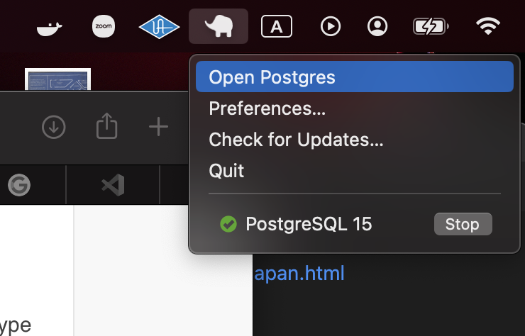
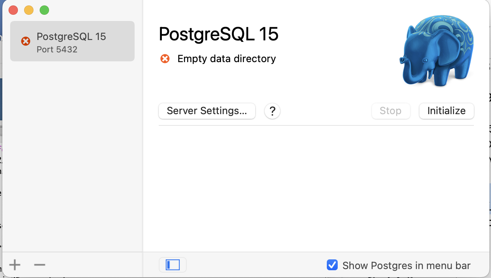
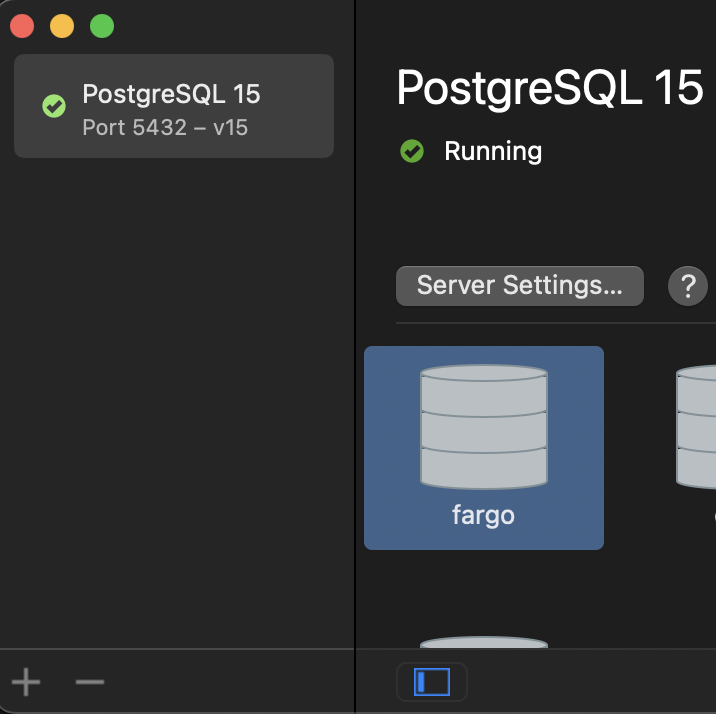

# Tilemillで地図づくり

### 1. 環境を整える

まずは地図制作のデータやソースコード用のフォルダーを作りましょう。

まずはTerminalアプリを開きます。主な作業はTerminalで行いますが、初めての方でもできます！

アプリを開くのにスポットライト（🔍）で「ターミナル」を検索してください。

Terminalが開いたら、次のコマンドを一行ずつ実行してください。

Documents/mapmakingはただの提案で、好きなフォルダを使って大丈夫です。

```
mkdir ~/Documents/mapmaking
cd ~/Documents/mapmaking
```

---

### 2. 必要なツールのインストール

すでにインストールしているものは飛ばして大丈夫です。

- Homebrew
```
/bin/bash -c "$(curl -fsSL https://raw.githubusercontent.com/Homebrew/install/HEAD/install.sh)"
```

- NodeJS
```
brew install node
```

- NVM
```
curl -o- https://raw.githubusercontent.com/nvm-sh/nvm/v0.39.2/install.sh | bash

export NVM_DIR="$([ -z "${XDG_CONFIG_HOME-}" ] && printf %s "${HOME}/.nvm" || printf %s "${XDG_CONFIG_HOME}/nvm")"
[ -s "$NVM_DIR/nvm.sh" ] && \. "$NVM_DIR/nvm.sh"
```

---

### 3. TileMillのウェブアプリをインストール

mapmakingのフォルダから、次のコマンドを一行ずつ実行してください。

```
git clone https://github.com/tilemill-project/tilemill.git
cd tilemill
nvm install lts/carbon
nvm use v8.15.0
npm install
npm start
```

---

### 4. データベースを作りましょう

TileMillは地図データをデータベースから読み込んで、地図を描写するようになっています。Googleマップと同じ仕様です。

まずはPostGresというデータベースアプリをインストールします。以下のアドレスでダウンロードできます。

https://postgresapp.com/downloads.html

インストールが終了したら、Applicationsフォルダから立ち上げると、メニューバーにゾウさん（🐘）のアイコンが現れます。

新しいTerminalのウィンドウを開いて、次のコマンドを実行します。
```
echo 'export PATH="/Applications/Postgres.app/Contents/Versions/9.3/bin:$PATH"' >> ~/.zshrc
source ~/.zshrc
```
念のために、Terminalを終了させて、再度開きます。もう一度、地図用のフォルダに移動します。
```
cd ~/Documents/mapmaking
```
あとは、地図用のデータベースを設定するだけです。
ゾウさんのアイコンをクリックして、「Open Postgres」を選びます。



何個かの筒状のアイコンが出てくるはずですが、以下の画像のように、立ち上げ時点で筒状のアイコンが現れない場合は、右のゾウさんの下にある「Initialize」ボタンをクリックしてください。



そこから、自分のパソコンの名前の筒をダブルクリックしてください（postgresとかtemplateじゃないもの）



ダブルクリックすると、新たにターミナルのウィンドウが開きます。これはPostGresのコマンドラインです。僕のパソコンは「fargo」という名で、コマンドラインは以下のような感じです。
```
Last login: Mon Dec 12 17:03:56 on ttys006
/Applications/Postgres.app/Contents/Versions/15/bin/psql -p5432 "fargo"         
(base) fargo@fagomashunoMBP ~ % /Applications/Postgres.app/Contents/Versions/15/bin/psql -p5432 "fargo"
psql (15.1)
Type "help" for help.

fargo=# 
```

ここに次のコマンドを、やはり一行ずつ実行します。
```
create database osm;
\connect osm
create extension postgis;
\quit
```


### 5. OpenStreetMapsデータをデータベースに打ち込む

OpenStreetMapsは世にも素敵なオープンソースプロジェクトで、世界中の地図データをクラウドソースして、無料で提供しています。

まずはデータをダウンロードしましょう！全ての町のビルや歩道、道や河川、その他の位置情報や命名が盛り込まれているだけに、データが重い！なので、必要なデータだけで大丈夫です。フォーマットはいくつかありますが、「pbf」を選びます。

全世界のデータはここ

http://download.geofabrik.de

日本だけのデータはここ

http://download.geofabrik.de/asia/japan.html

関西だけならここです

http://download.geofabrik.de/asia/japan/kansai.html

ダウンロードは多少時間がかかりそうなので、OpenStreetMapsデータをデータベース仕様に変換するツールをインストールしましょう。

### 6. データ変換ツール「OSM2PGSQL」をインストール

ここは簡単です
```
brew install osm2pgsql
```

### 7. データをぶち込みましょう。

ここは簡単ですが、お使いのパソコンと、ダウンロードしたデータの重さによって少し時間かかる場合もあります。

以下のコマンドの「your_file.osm.pbf」を、ダウンロードしたファイル名に変えてください。関西だけだと「kansai-latest.osm.pbf」、全日本なら「japan-latest.osm.pbf」になります。

```
osm2pgsql -cGs -d osm -S /usr/local/share/osm2pgsql/default.style ~/Downloads/your_file.osm.pbf
```

ここまで来れたら、あとは下り坂です！


## 8. 地図制作ウェブアプリをダウンロード

以下のzipをダウンロードして、最初のステップで作ったDocuments/mapmakingフォルダで解凍してください。
https://github.com/mapbox/osm-bright/zipball/master 

`mapbox-osm-bright-f1c8780`みたいな見苦しいネーミングになっているので、`mapbox-osm`とか、もっと読みやすいネーミングに変更しましょう。

このフォルダに移行します。

```
cd ~/Documents/mapmaking/mapbox-osm
```

その中で、さらにフォルダを作って、「shapefile」というテンプレートを3つほどダウンロードします。

```
mkdir shp
cd shp
curl https://osmdata.openstreetmap.de/download/simplified-land-polygons-complete-3857.zip
curl https://osmdata.openstreetmap.de/download/land-polygons-split-3857.zip
curl https://www.naturalearthdata.com/download/10m/cultural/ne_10m_populated_places.zip
```

「land-polygons-split-3857.zip」は大きめなファイルなので、少し時間かかります。

ダウンロードが終わったら、3つとも解凍して、元のzipを捨ててください。

最後にアプリをコンパイルします。
```
cd ~/Documents/mapmaking/mapbox-osm
cp configure.py.sample configure.py
```

この「configure.py」というフィアルを「テキストエディット」で開いてください。13行目で、プロジェクト名を好きな名前に変えてください（とにかく変える必要があります）
```config["name"] = "MY PROJECT NAME"```

あとはコンパイルだけです。ターミナルに戻って、次のコマンドを実行してください。

```
python2 make.py
```

あとはアプリを起動させるだけです。

```
cd ~/Documents/mapmaking/tilemill
npm start
```

ブラウザー（Safariがオススメ）で以下のURLでアプリを使えます。

http://localhost:20009/


